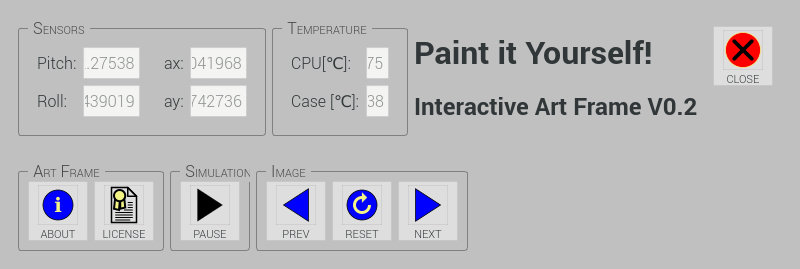

`art-frame` — A Colored Sand Art Image Emulation
=================================================

`art-frame` is an interactive, cross-media object of artwork for
transforming existing images into creative new ones.  The idea behind
is similar to a digital emulation of creating a colored sand art
image.  It models the image contents as a huge set of colored sand
particles flowing freely within the art frame's border, considering
gravity and acceleration literally at your finger tips.  The artwork
consists of the `art-frame` software that runs on a Raspberry Pi, with
the RPi 7'' Touch Display and the RPi Sense Hat attached.

Features
--------

The current version of `art-frame` considers two main sources for
processing the particles flow:

* gravity, and
* acceleration from touch movements.

Some future version of `art-frame` may also consider acceleration data
from the Sense Hat, e.g. by affecting particles flow when the device
is heavily shaken.

### Gravity

In [this time lapse
recording](https://www.youtube.com/watch?v=MNid8_C_m38), you will see
the effect of gravity, with the darker particles effectively sinking
down and the lighter particles raising up.  Roughly in the middle of
the video, the particles flow almost stops.  The art-frame is then
rotated counterclockwise by 90° (you can not see the rotation in the
video, since the video is a screen recording rather than a video
showing the art-frame object).  After rotating the device, the
particles again start flowing until finally the flow abates again.

### Sweep

After the flow has abated, in the [this time lapse
recording](https://www.youtube.com/watch?v=OGbuycnTfsE) you can see
the _sweep_ effect: just move one finger tip across the surface of the
touch display to manually move sand particles across the frame.

### Physical Correctness

`art-frame` does _not at all_ strive to be physically correct — in
fact, `art-frame` is meant as an interesting artwork, and not as a
scientifically exact tool.  In the previous video, you can clearly see
that there are additional, unexpected turbulences, and that the flow
quickly abates at a time when not nearly all particles have flown to
their expected location.  That is, `art-frame` does not implement a
physically correct simulation.  It rather implements some kind of
simulation that comes somewhat close to real physics, but yields
interesting, possibly unexpected results.

### Example Screenshots

Here are some impressions of manipulated images, derived from the
desktop background images, that are delivered with the Raspbian OS:

Fig. 1: Road 1

Fig. 2: Road 2

Fig. 3: Temple 1

Fig. 4: Temple 2

Fig. 5: Waterfall 1

Fig. 6: Waterfall 2

Fig. 7: Waterfall 3

Simulation Speed
----------------

The above videos are time lapse recordings.  In reality, the
simulation takes somewhat more time, heavily depending on which
Raspberry Pi is used and at which frequency it is operating.
Additionally, the software automatically slows down the simulation if
the CPU gets hot.  The details of this behavior can be configured in
the software's configuration file.  In other words, if the CPU is well
cooled (e.g. by using a wide or open case, or by installing a fan),
the simulation will run faster.

Hardware Requirements
---------------------

* Raspberry Pi 3 or higher (cp. note 1)
* Raspberry Pi 7'' Touch Display (cp. note 2)
* Raspberry Pi Sense Hat (cp. note 3)
* Highly recommended: a case similar to one for a digital image frame
* Optionally: Cooling Fan (cp. note 4)
* Optionally: USB keyboard or media center controller (cp. note 5)

**Note 1:** I have the software successfully running on a Raspberry
Pi 3.  I seriously expect that the software will also run on a
Raspberry Pi 3B+ or 4, though I have not yet had the opportunity to
test it.

**Note 2:** The touch display is required to be attached to the
Raspberry Pi and properly installed.

**Note 3:** The sense hat is required to be attached to the Raspberry
Pi and properly installed.

**Note 4:** Pin GPIO 4 is configured to control the cooling fan,
provided a fan is installed.  High voltage level on that pin should
result in running the fan, while low voltage on that pin should result
in keeping it off.  Note that the GPIO pins do not provide enough
current to directly drive a fan.  In fact, connecting a fan directly
to the GPIO pin may damage your Raspberry Pi.  Instead, use the output
level of the GPIO pin to drive a transistor that switches the fan on
and off.  If you do not install a fan or do not want to make use of
the signal provided on the GPIO 4 output, it is fully ok to leave the
GPIO 4 pin unconnected.

**Note 5:** Usually, for ordinary user control, the touch screen is
fully sufficient.  However, for certain functions like shutting down
the system (especially when the action button for this function is
disabled in the graphical UI), a USB keyboard or media center
controller or similar device may be very useful.  Also, support for
making screenshots is currently available only in a rudimentary state,
and therefore you may eventually want to use a keyboard for switching
into a text console and transferring your screenshots.

Source Code
-----------

Source code is licensed as open source under GPL v3 and is available
here:

[https://github.com/soundpaint/art-frame](https://github.com/soundpaint/art-frame)

Installation & Configuration
----------------------------

For details, see the file [INSTALL.md](INSTALL.md).

In summary:

* Install some additional packages for Qt, XML, USB, audio and
  processing of art work.
* Download the sources.
* Compile the sources.
* Tweak some spots of the Pi's boot process.
* Configure the application to tailor your needs.
* Optionally provide additional images.
* Run it & have fun.

User Interface
--------------

### Access Control GUI

While the art-frame application is running, you can alyways access the
control GUI by double-touching the screen (just like a double click
with a mouse), unless you have explicitly disabled the control GUI in
the application's configuration.  Be careful that both touches apply
to the very same location on the screen.  If the second touch is
slightly off regarding the position on the screen, the double touch
will show no effect.  Similarly, the double touch will show no effect
if it either occurs to fast, or if the amount of time between the
first and the second touch is too large.  You probably best achieve a
double touch if you keep your finger our pointing device very close to
the surface and perform a very light touch.  This way, you have better
fine-control over your touch and increase the chance to hit exactly
the same position twice.

Fig. 8: Fully-Fledged Access Control Window

#### _Sensors_ Group

The _Sensors_ group shows sensor values from the sensor hat:

* the orientation of the art frame (_pitch_ and _roll_), and
* the acceleration of the art frame (_ax_ and _ay_).

#### _Temperature_ Group

The _Temperature_ group shows sensor values from the Raspberry Pi main
board:

* the temperature of the CPU (in °Celsius), and
* the temperature of the case (also in °Celsius).

#### _Art Frame_ Group

The _Art Frame_ group contains action buttons to

* show the _About_ window,
* show the _License_ window, and
* quit the application (and, optionally, thereby completely shut down
  the system).

#### _Simulation_ Group

The _Simulation_ group contains

* an action button to stop / resume the simulation, and
* a dial widget to control the violence of the simulation.

The violence of the simulation is a still experimental feature.  The
selected value should be a value near 0, but not equal to 0.  A value
of 0 will effectively pause the simulation.

#### _Image_ Group

The _Image_ group contains action buttons for

* switching to the previous of all configured images,
* resetting the current image to its initial state, and
* switching to the next of all configured images.

#### _Audio_ Group

The _Audio_ group contains

* an action button for muting / unmuting audio output, and
* a dial widget for controlling the audio volume.

The art frame application creates a (nearly) white noise sound.  The
loudness of the sound is proportional to the number of particles that
are currently moving.

#### _Close_ Action Button

Use the _Close_ action button to explicitly close the access control
window.  By default, the access control window will automatically
close if, for a specific amount of time, no button is pressed and no
dial value changed.  The specific amount of time can be configured
with the `control-autohide-after` control variable in the `kiosk-mode`
section of the `config.xml` configuration file.

### Other Windows

The access control window also provides access to an _About_ window.
This window can be activated either by the _About_ button or by any of
the configured keys for the _About_ action (be default, the _A_ key).

Fig. 9: _About_ Window

There is also a window showing the license.  This window can be
activated either by the _License_ button or by any of the configured
keys for the _License_ action (be default, the _C_ key).

Fig. 10: _License_ Window

### Kiosk Mode

In specific environments such as in an art exhibition, users may be
encouraged to play with the art frame, without a supervisor always
being present.  In such a setting, one may want to disable some
functionality such as shutting down the system or displaying audio
control features without any functional speaker attached to the
device.  In the `kiosk-mode` section, the configuration file
`config.xml` contains specific configuration variables to enable or
disable specific functionality available via the graphical GUI as well
as via any USB-connected keyboard.

Fig. 11: Minimal Access Control Window

Actually, the access control window can be completely deactivated, if
desired.

### How to Exit

The usual way to exit the art frame application is to either use the
_Quit_ button on the access control window or to press any of the
configured key for the _Quit_ action (by default, either the _Esc_ key
or the _Q_ key).  Upon quit, a confirmation dialog pops up.

Fig. 12: Shutdown Confirmation Dialog

Especially when installing the art-frame in a public room, you
probably do not want to let people access the internals of your
Raspberry Pi and / or shutting down the system via the GUI.

As explained above, the art-frame application's configuration file
offers many possibilities for access restrictions (called “kiosk-mode”
in the configuration file), from just disabling the “quit” button to
disabling the complete GUI control widget.  However, if you disable
all that stuff, how can you then ordinarily shut down the system by
yourself?

There some options:

* Connect a USB keyboard to the Pi.  Depending on the configuration,
  you may quit the art-frame application with a single key stroke.
  Alternatively, you may press, say, `CTRL + ALT + F3` to get the
  login prompt for a text console which enables you to kill the
  `art-frame.sh` shell script.
* If you have disabled keyboard functionality (because you fear people
  may connect a keyboard via USB), you may alternatively enable the
  SSH server on your Pi and then login from a remote host and kill the
  `art-frame.sh` shell script via the remote shell.
* You may configure a cron job that automatically shuts down the Pi at
  some time of the day.

### Image Capturing

There is an experimental feature for capturing images.  Currently,
this feature is accessible only by a key press, but not yet via the
GUI.  By default, the key _T_ maps to the capture action.  When
pressing that key, the currently displayed image (more precisely: the
current image representation of the simulation status) is saved to a
file.  The target directory is specified with the `path` configuration
variable in the `capturing` section of the `config.xml` configuration
file.  By default, the path maps to the current working directory `.`,
which usually resolves to the path `/home/pi/art-frame/bin/build`,
where the art-frame binary resides.  The filename consists of a
prefix, a timestamp, and the `.png` suffix for the portable network
graphics media type of the generated image file.

### Usage Tipps & Tricks

* When the particles flow abates, rotate the device e.g. by 90° or
  180° degrees.
* The effect of a sweeps works best in areas with differently colored
  particles.
* When you feel that sweeps with your finger have only little effect,
  try rotating the device, then wait for a short while for particles
  of different color to mix, and then try again sweeping.
* Try sweeping across areas with different dominating colors to create
  areas of unrest.
* Try sweeping along the border of areas with different dominating
  colors in order to emphasize contours that already exist in the
  image.
* Making fast sweeps with your finger will result in rather straight
  lines, while making slow sweeps will result in rather curved lines.
